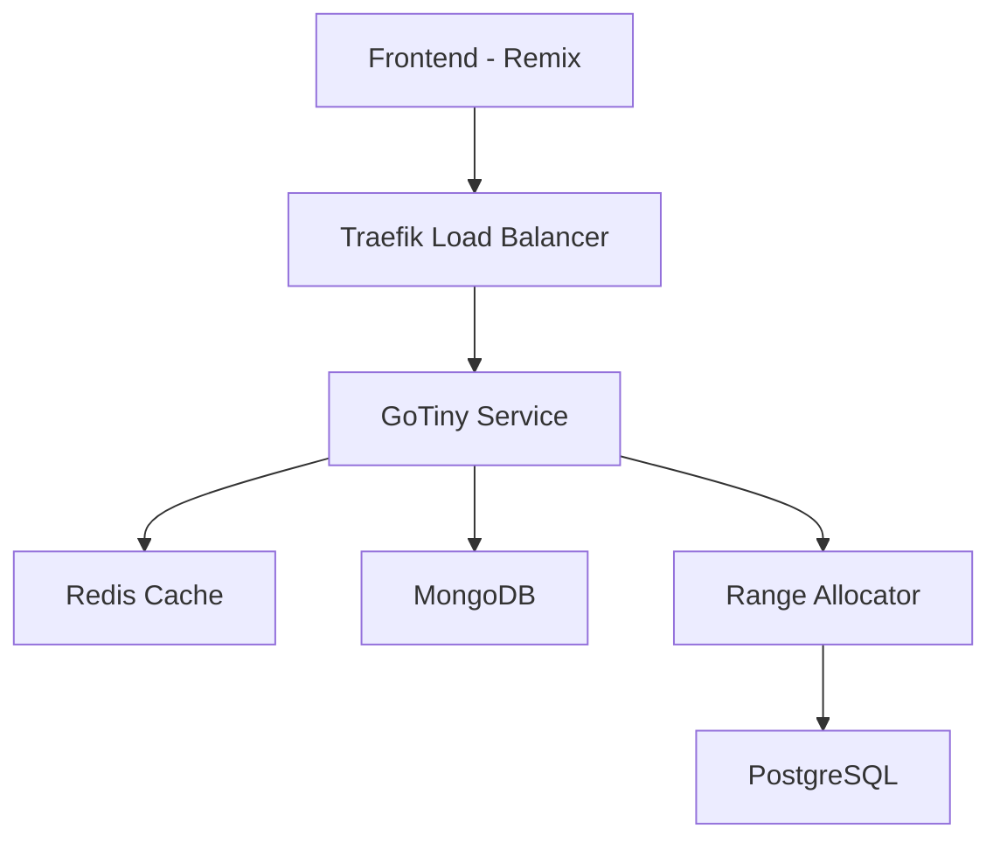

# GoTiny - URL Shortener Service

A distributed URL shortening service built with Go, featuring high availability, scalability, and reliable shortcode generation.

## Core Features

- Distributed URL shortening across multiple instances
- Base62 encoding for readable short URLs
- Distributed range allocation for unique IDs
- Redis caching for fast URL retrieval
- MongoDB for persistent URL storage
- Traefik for load balancing and routing
- Docker containerization and orchestration
- Health monitoring and automatic container updates
- gRPC communication between services

## System Components

- **Frontend**: [GoTiny App](https://github.com/RajNykDhulapkar/gotiny-app) - Built with Remix Run and ShadCN/UI
- **Backend**: This repository - Go service for URL shortening
- **Range Allocator**: [Range Allocator Service](https://github.com/RajNykDhulapkar/gotiny-range-allocator) - Manages ID ranges

## Architecture



## Quick Start

1. Clone the repository:

```bash
git clone https://github.com/RajNykDhulapkar/gotiny.git
cd gotiny
```

2. Setup local environment:

```bash
./scripts/setup.sh
```

3. Start services:

```bash
docker-compose up -d
```

## Configuration

Environment variables:

```env
GOTINY_PORT=8080
REDIS_URL=redis:6379
RANGE_ALLOCATOR_ADDRESS=range-allocator:50051
SERVICE_ID=url-shortener
MONGODB_URI=mongodb://mongodb:27017
MONGODB_DATABASE=urlshortener
```

## API Endpoints

- `POST /create-short-url` - Create short URL
- `GET /:shortUrl` - Redirect to original URL
- `GET /urls/:userId` - Get user's URLs
- `GET /health` - Service health check

## Development

```bash
# Install dependencies
make deps

# Run locally
make run

# Build
make build

# Run tests
make test
```

## License

MIT License

## Acknowledgments

- [Gin Web Framework](https://github.com/gin-gonic/gin)
- [Remix Run](https://remix.run/)
- [ShadCN/UI](https://ui.shadcn.com/)
